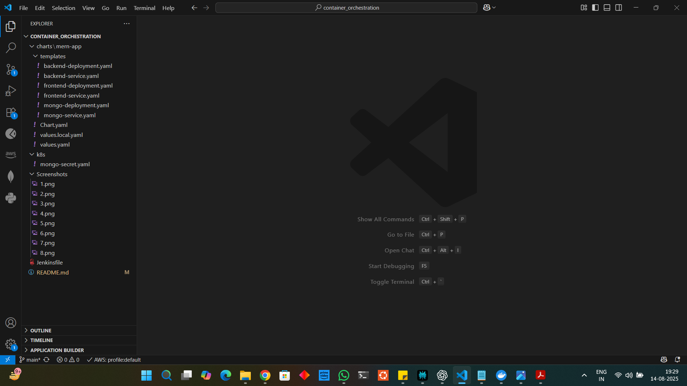
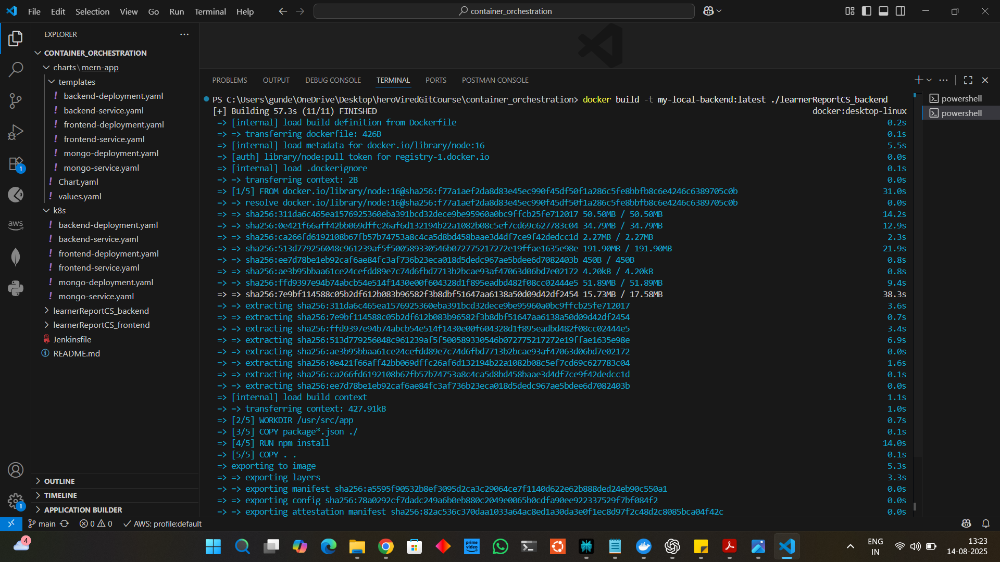

# Microservices CI/CD Pipeline with Jenkins, Docker, and Kubernetes

This repository contains a fully automated **CI/CD pipeline** for a microservices-based **MERN** application with separate **frontend** and **backend** services. The pipeline builds, tests, and deploys the application to a **Kubernetes** cluster using **Jenkins**, **Docker**, and **Helm**.

---

## Table of Contents

* [Assignment Overview](#assignment-overview)
* [Core Technologies](#core-technologies)
* [Repository Structure](#repository-structure)
* [Kubernetes and Helm Structure](#kubernetes-and-helm-structure)
* [Pipeline Workflow](#pipeline-workflow)
* [Setup and Execution](#setup-and-execution)
* [Challenges and Solutions](#challenges-and-solutions)
* [Accessing the Application](#accessing-the-application)

---

## Assignment Overview

This project demonstrates a robust, fully automated CI/CD pipeline for a microservices-based MERN application.

**Key Features:**

* **Continuous Integration (CI):** Fetches latest code, builds Docker images, and pushes them to Docker Hub.
* **Continuous Deployment (CD):** Deploys updated images to a Kubernetes cluster using Helm.
* **Infrastructure as Code:** All configurations, manifests, and Helm charts are defined in this repository.

---

## Core Technologies

* **Jenkins:** CI/CD Automation Server
* **Docker:** Containerization
* **Kubernetes:** Container Orchestration
* **Helm:** Kubernetes Package Manager
* **GitHub:** Source Code Management
* **Docker Hub:** Container Registry

---

## Repository Structure

```
container_orchestration/
├── k8s/                        # Kubernetes manifests
│   └── mongo-secret.yaml
├── charts/                     # Helm chart for the MERN application
│   └── mern-app/
│       ├── Chart.yaml
│       ├── values.yaml
        ├── values.local.yaml   # Used for local deployment
│       └── templates/
│           ├── backend-deployment.yaml
│           ├── backend-service.yaml
│           ├── frontend-deployment.yaml
│           ├── frontend-service.yaml
│           ├── mongo-deployment.yaml
│           └── mongo-service.yaml
├── Screenshots/                # Stores the screenshots
├── Jenkinsfile                 # CI/CD pipeline definition
└── README.md                   # Documentation
```

---

## Kubernetes and Helm Structure

The Kubernetes and Helm structure is designed to deploy and manage the microservices efficiently.

### Kubernetes (`k8s/`)

* **mongo-secret.yaml:** Contains sensitive information like MongoDB credentials as Kubernetes Secrets.

### Helm Chart (`charts/mern-app/`)

* **Chart.yaml:** Metadata for the Helm chart.
* **values.yaml:** Configuration values for the chart, such as image repository, tags, and service ports.
* **templates/**

  * **backend-deployment.yaml:** Deployment manifest for the backend service.
  * **backend-service.yaml:** Service definition for backend access.
  * **frontend-deployment.yaml:** Deployment manifest for the frontend service.
  * **frontend-service.yaml:** Service definition for frontend access.
  * **mongo-deployment.yaml:** Deployment for MongoDB.
  * **mongo-service.yaml:** Service definition for MongoDB access.

This separation ensures that infrastructure, configurations, and secrets are maintained cleanly and can be deployed consistently across different environments using Helm.

---

## Pipeline Workflow

The **Jenkinsfile** orchestrates the CI/CD pipeline in the following stages:

1. **Agent Setup:**
    - Created a local Dockerfile

    ```dockerfile
    FROM dtzar/helm-kubectl:latest
    # Install Docker CLI
    USER root
    RUN apk add --no-cache docker-cli
    USER jenkins
    ```

    - Then build my own image 

    ```powershell
    docker build -t yourdockerhubusername/helm-kubectl-docker:latest .
    docker push yourdockerhubusername/helm-kubectl-docker:latest
    ```

    - Use it in Jenkins pipeline
    ```groovy
    agent {
        docker {
            image 'yourdockerhubusername/helm-kubectl-docker:latest'
            args '-v /var/run/docker.sock:/var/run/docker.sock'
        }
    }
    ```

2. **Checkout and Clone Repositories:**

   * Clones this deployment repository
   * Clones the external **frontend** and **backend** repositories

3. **Build Docker Images:**

   * A critical fix is applied on-the-fly to the frontend Dockerfile to solve a dependency issue (`npm install --legacy-peer-deps`)
   * Builds frontend and backend Docker images and tags them with Docker Hub username

4. **Push Docker Images:**

   * Pushes images to Docker Hub using securely stored Jenkins credentials

5. **Deploy to Kubernetes:**

   * Applies MongoDB secret (`kubectl apply`)
   * Deploys the application stack using Helm (`helm upgrade --install`)

6. Final [Jenkinsfile](Jenkinsfile)

---

## Setup and Execution

### Prerequisites

* Docker Desktop with Kubernetes enabled
* GitHub account
* Docker Hub account
* Running Jenkins instance

### Local Deployment

1. Clone **frontend** and **backend** repos.
2. Build Docker images:

```bash
# Backend
docker build -t my-local-backend:latest ./learnerReportCS_backend

# Frontend
docker build -t my-local-frontend:latest ./learnerReportCS_frontend
```

*Resolve frontend npm issues with `--legacy-peer-deps` flag.*




3. Use local Helm values:


```bash
helm upgrade --install mern-app ./charts/mern-app -f ./charts/mern-app/values.local.yaml
```


4. Stop deployment:

```bash
helm uninstall mern-app
```

### Jenkins Deployment

1. **Launch Jenkins with Docker Access**

```bash
docker run -p 8080:8080 -p 50000:50000 \
  -v jenkins_home:/var/jenkins_home \
  -v /var/run/docker.sock:/var/run/docker.sock \
  --name jenkins jenkins/jenkins:lts
```

2. **Install Jenkins Plugins**

* Docker Pipeline
* Kubernetes CLI

3. **Configure Jenkins Credentials**

* **Docker Hub:** "Username with password" credential (`dockerhub-creds`)
* **Kubeconfig:** "Secret file" credential (`kubeconfig`)

4. **Create Jenkins Pipeline Job**

* Select **Pipeline** → **Pipeline script from SCM**
* Enter repository URL and branch (`main`)

5. **Run the Pipeline**

* Click **Build Now** to trigger the CI/CD workflow

---

## Challenges and Solutions

| # | Challenge                        | Problem Description                            | Solution                                                         |
| - | -------------------------------- | ---------------------------------------------- | ---------------------------------------------------------------- |
| 1 | Local Build Failure              | Frontend Docker build fails during npm install | Use `npm install --legacy-peer-deps`                             |
| 2 | Initial K8s Deployment           | Needed local values.yaml for Helm testing      | Created `values.local.yaml` with `imagePullPolicy: Never` |
| 3 | Jenkins Can't Find Git Branch    | Default branch is `main` not `master`          | Updated Branch Specifier to `*/main`                             |
| 4 | docker: not found in Pipeline    | Jenkins agent lacked Docker access             | Mounted Docker socket from host                                  |
| 5 | Agent Lacked Tools               | Kubectl and Helm missing in agent              | Used custom agent image `kalra1994/helm-kubectl-docker:latest`   |
| 6 | npm Build Fails in Pipeline      | Peer dependency errors reappear                | Pipeline edits Dockerfile automatically using `sed`              |
| 7 | Permission denied pushing Docker | Docker login fails inside container            | Wrapped push stage with `withEnv(["HOME=${env.WORKSPACE}"])`     |
| 8 | Connection refused to Kubernetes | Agent lacked cluster access                    | Uploaded kubeconfig to Jenkins and used `withKubeConfig`         |

---

## Accessing the Deployed Application

1. **Check Pods & Services**

```bash
kubectl get pods
kubectl get service
```


2. **Find Frontend URL**

* Locate frontend service with `TYPE: LoadBalancer`
* Use `EXTERNAL-IP` and `PORT(S)` to access

3. **Open in Browser**

* Usually: `http://localhost`
* You should see the running MERN application

